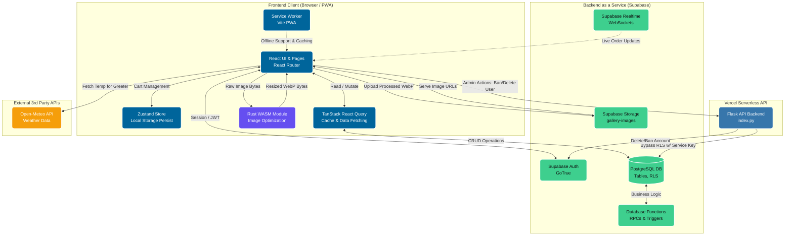
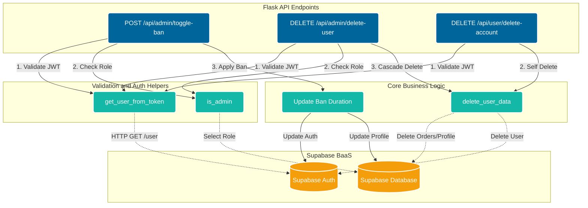
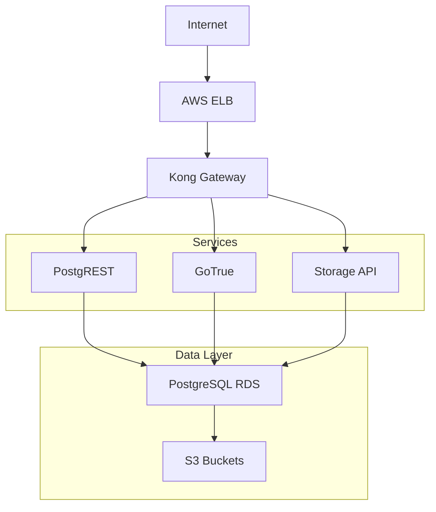

# Architecture 

## High-Level Diagram



## Flask API Diagram



## Folder Structure 

```text
Capstone-Project/
├── .github/
│   └── workflows
├── api
├── assets
├── docs
├── public
├── src/
│   ├── assets
│   ├── components/
│   │   ├── account
│   │   ├── admin/
│   │   │   ├── analytics
│   │   │   ├── gallery
│   │   │   ├── menu
│   │   │   ├── orders
│   │   │   └── users
│   │   ├── auth
│   │   └── checkout
│   ├── context
│   ├── hooks
│   ├── locales
│   ├── pages/
│   │   ├── admin/
│   │   │   ├── gallery
│   │   │   ├── menu
│   │   │   ├── orders
│   │   │   └── users
│   │   ├── auth
│   │   ├── checkout
│   │   ├── error
│   │   └── legal
│   ├── store
│   ├── tests
│   ├── types
│   └── utils
└── wasm-lib/
    ├── pkg
    └── src
```

## State Management

#### State management is the client-side brain of an app. The state management for this app is seperated into **three distinct categories** based on purpose:

### 1. Tanstack React Query (Server State)

Fetching data from the database is not just about getting the data. It is also about caching, loading states, error
handling, and background refetching. In this app, we are often fetching dish, menu, and order data. This data is always 
changing and Tanstack React Query allows the frontend to be a synchronized mirror of the database. This is achieved by
utilizing `queryClient.invalidateQueries()` when a user/admin inserts, deletes, or updates. For instance, it is used
to invalidate the user's orders after they delete one of their orders, causing an instant refetch without refreshing.

### 2. Zustand (Global Client State)

This is used for cart management which lives completely in the user's browser. It allows the cart to be accessible
across the entire app. Zustand was chosen over Redux and other state managers due to it being lightweight. We persist
cart data to `localStorage` which means if a user fills up their cart and accidentally close their browser, they can
come back and their cart will be fully restored. We do clear the cart on sign out because if a user signs out and
someone else signs in on that device, we don't want them to inherit the previous user's cart.

### 3. React Context (Authentication State)

Our AuthContext component wraps the entire app, instantly listening to Supabase's `onAuthStateChange`. This provides the
app with the current user and their role (who they are, what they can do). This is what enables RBAC 
(Role-Based Access Control) and RLS (Row-Level Security). Certain pages are not renderable to unauthenticated users or
users who are not admins. Additionally, certain actions are not possible for certain users as the API endpoints for the
tables are protected by RLS.

## Server Management

#### We utilize a hybrid cloud architecture for server management which will be explained in detail:

### Supabase (Primary Backend (BaaS))

All CRUD operations, Authentication, and Image Storage are offloaded and handled by Supabase. This greatly reduced the
need for boilerplate code. We have RLS policies on all tables which means if someone intercepts the API endpoints, they
still cannot read or modify data that doesn't belong to them. 

What is happening under the hood:



Easiest way to think of this is Supabase being a layer on top of AWS that turns cloud infrastructure into a 
Postgres-first backend platform. Without Supabase, we would need to manually build:

- EC2 instances
- Auth system
- File upload service
- WebSocket server
- Database permissions layer

Here is table that further demonstrates how Supabase uses AWS:

| AWS | Supabase |
|---|---|
| EC2 | API, auth, realtime services |
| RDS/Postgres | database/backend logic |
| S3 | file storage |
| ELB | unified API endpoint |

### Flask (Vercel Serverless)

We built a lightweight Flask backend that is deployed with Vercel Serverless. Vercel uses AWS Lambda under the hood to
make Vercel Serverless work. We built these APIs to do destructive actions (deleting accounts, issuing bans). This
requires the Service Role Key as it bypasses RLS. We can not under any circumstances expose this key to the browser.
That is why these actions are performed server-side. 

The system works by having the React frontend pass the current user's JWT token to Flask. After that, Flask confirms the
user is a legitimate **admin**. Once this is confirmed, the action is performed. Overall, the system follows the
principle of least privilege.

### RPCs and Triggers

Complex business logic was moved out of the client-side and implemented on the server-side (Supabase). For example, we
use the `place_order` RPC (Remote Procedure Call) to process the order in a full atomic transaction. This is to prevent 
**race conditions**.

### pg_cron (Automated Maintenance)

We implemented `pg_cron` in the database to run at 4:00 AM UTC which is midnight EDT. It automatically sweeps the
database and sets expired `PENDING` orders to `INACTIVE`.

### WebSockets (Event-Driven Architecture)

**Pending Orders** is a page that we felt needed to be highly-reactive to deliver the ideal UX. That is why we tapped
into Supabase Realtime. This allows Tanstack React Query to listen to changes in the database and instantly display
changes.

## Authentication 

We had to build our own authentication system using email and password as we didn't have access to the Sault College 
Azure tenant.  For this reason, we built a multi-layered security model:

### 1. Domain-Restricted Identity

**Gourmet2Go** is only for the Sault College community. We have prevented non-Sault College students from making an
account on the client and server. We made a Zod schema for sign in and sign up that uses a regex pattern: 

```ts
.refine((email) => /^[0-9]{8}@saultcollege\.ca$/i.test(email), {
      message: "You must use your 8-digit Sault College email to sign in",
    }),
```

This ensures that the email has an 8 digit student number and has the Sault College domain. Also, we made 
`handle_new_user` in Supabase that is a function that is triggered after a new entry in `auth.users`. If the email
provided in the sign up does not have a Sault College domain, then the user will automatically be given the `NO_ACCESS`
role in the `profiles` table. If it does have the Sault College domain, then they are given the `USER` role. If you 
have the `NO_ACCESS` role and try to sign in, you will be signed out right away.

### 2. RBAC

There are three tiers to the roles (`NO_ACCESS`, `USER`, `ADMIN`). Admins are treated as superusers. The role is
provided `AuthContext`.  At the UI level, things like the Administration tab are not rendered unless you are an `ADMIN`.
At the routing level, `ProtectedRoute` acts as a bouncer, redirecting unauthenticated users to the 401 error page.

### 3. Database-Level Protection

Users are allowed to update their name but nothing else. If a user makes a curl command to `PATCH` their role to be an
`ADMIN`, we stop it with the `protect_profile_columns` trigger. This overrides the malicious input with the original
values.

### 4. JWT Validation

When we call the Flask API, we pass the current user's bearer token. Flask verifies it against the Supabase Auth server,
extracts the user ID, and queries the profiles table to ensure the current user is an `ADMIN`. Then, it will perform the 
destructive action.

## PWA

**Gourmet2Go** is a PWA (Progressive Web App) which is used to deliver a native app-like experience. This means the web
app can be downloaded like a desktop app and mobile app. We utilize PWA technology to cache data using a Service Worker.
This means if a user cannot get onto school wi-fi and don't have data, they can still go onto the app and have their QR
code ready for pickup. This is one of many benefits of having the app usable offline.

## WASM

Since Supabase only offers 1 GB of storage in the free tier, we needed to optimize. This is why we built a Rust script
that was compiled to WASM (Web Assembly). When an Admin uploads a photo to the gallery, it resizes the image to 1280x960
which is an HD image (slightly above 720p) with a 4:3 aspect ratio. It also converts the image to a WebP which are
smaller than PNGs and JPEGs. This all happens client-side which is nice because we don't have to worry about image
processing endpoints being abused.

## RPC Functions

### cancel_orders

```sql
DECLARE
  v_user_id UUID;
  v_status TEXT;
  v_menu_id INT;
  v_menu_date DATE;
  v_now_est TIMESTAMP;
  v_today_est DATE;
  v_item RECORD;
BEGIN
  SELECT user_id, status, menu_id 
  INTO v_user_id, v_status, v_menu_id
  FROM public."Orders"
  WHERE order_id = p_order_id;

  IF NOT FOUND THEN
    RAISE EXCEPTION 'Order not found.';
  END IF;

  IF v_user_id <> auth.uid() THEN
    RAISE EXCEPTION 'Unauthorized: You do not own this order.';
  END IF;

  IF v_status <> 'PENDING' THEN
    RAISE EXCEPTION 'Only pending orders can be cancelled.';
  END IF;

  SELECT "date"
  INTO v_menu_date
  FROM public."MenuDays"
  WHERE menu_day_id = v_menu_id;

  v_now_est := timezone('America/Toronto', CURRENT_TIMESTAMP);
  v_today_est := v_now_est::date;

  IF v_menu_date < v_today_est THEN
    RAISE EXCEPTION 'Order cancellation period has passed.';
  END IF;

  IF v_menu_date = v_today_est AND v_now_est::time >= TIME '12:00' THEN
    RAISE EXCEPTION 'Same-day orders cannot be cancelled after noon.';
  END IF;

  FOR v_item IN
    SELECT dish_id, quantity
    FROM public."OrderItems"
    WHERE order_id = p_order_id
  LOOP
    UPDATE public."MenuDayDishes"
    SET stock = stock + v_item.quantity
    WHERE menu_id = v_menu_id AND dish_id = v_item.dish_id;
  END LOOP;

  DELETE FROM public."OrderItems" WHERE order_id = p_order_id;
```

### cancel_pending_orders

```sql
DECLARE
  v_user_id UUID;
  v_status TEXT;
  v_menu_id INT;
  v_item RECORD;
BEGIN

  SELECT user_id, status, menu_id INTO v_user_id, v_status, v_menu_id
  FROM public."Orders"
  WHERE order_id = p_order_id;

  IF NOT FOUND THEN
    RAISE EXCEPTION 'Order not found.';
  END IF;

  IF v_user_id != auth.uid() THEN
    RAISE EXCEPTION 'Unauthorized: You do not own this order.';
  END IF;
  
  IF v_status != 'PENDING' THEN
    RAISE EXCEPTION 'Only pending orders can be cancelled.';
  END IF;
  FOR v_item IN 
    SELECT dish_id, quantity 
    FROM public."OrderItems" 
    WHERE order_id = p_order_id 
  LOOP
    UPDATE public."MenuDayDishes"
    SET stock = stock + v_item.quantity
    WHERE menu_id = v_menu_id AND dish_id = v_item.dish_id;
  END LOOP;
  DELETE FROM public."OrderItems" WHERE order_id = p_order_id;
```

### place_order

```sql
DECLARE
  v_order_id INT;
  v_total DECIMAL(10,2) := 0;
  v_item RECORD;
  v_dish_price DECIMAL(10,2);
  v_stock INT;
  v_order_number INT;

  v_menu_date DATE;
  v_now_est TIMESTAMPTZ;
  v_today_est DATE;
BEGIN
  SELECT "date"
  INTO v_menu_date
  FROM public."MenuDays"
  WHERE menu_day_id = p_menu_id;

  v_now_est := CURRENT_TIMESTAMP;
  v_today_est := (v_now_est AT TIME ZONE 'America/Toronto')::date;

  IF v_menu_date < v_today_est THEN
    RAISE EXCEPTION 'Ordering period has passed for this menu.';
  END IF;

  IF v_menu_date = v_today_est
     AND (v_now_est AT TIME ZONE 'America/Toronto')::time >= TIME '12:00' THEN
    RAISE EXCEPTION 'Same-day ordering closes at noon.';
  END IF;

  IF EXISTS (
    SELECT 1 FROM public."Orders"
    WHERE user_id = auth.uid() AND menu_id = p_menu_id
  ) THEN
    RAISE EXCEPTION 'You already have an active order for this menu.';
  END IF;

  FOR v_item IN
    SELECT * FROM jsonb_to_recordset(p_items) AS x(dish_id INT, quantity INT)
  LOOP
    SELECT m.stock, d.price
    INTO v_stock, v_dish_price
    FROM public."MenuDayDishes" m
    JOIN public."Dishes" d ON m.dish_id = d.dish_id
    WHERE m.menu_id = p_menu_id AND m.dish_id = v_item.dish_id
    FOR UPDATE;

    IF v_stock < v_item.quantity THEN
      RAISE EXCEPTION 'Not enough stock for dish %', v_item.dish_id;
    END IF;

    v_total := v_total + (v_dish_price * v_item.quantity);
  END LOOP;

  v_order_number := floor(random() * 90000000 + 10000000)::int;

  INSERT INTO public."Orders"
    (user_id, menu_id, notes, total, order_number, status)
  VALUES
    (auth.uid(), p_menu_id, p_notes, v_total, v_order_number, 'PENDING')
  RETURNING order_id INTO v_order_id;

  FOR v_item IN
    SELECT * FROM jsonb_to_recordset(p_items) AS x(dish_id INT, quantity INT)
  LOOP
    SELECT price INTO v_dish_price
    FROM public."Dishes"
    WHERE dish_id = v_item.dish_id;

    UPDATE public."MenuDayDishes"
    SET stock = stock - v_item.quantity
    WHERE menu_id = p_menu_id AND dish_id = v_item.dish_id;

    INSERT INTO public."OrderItems"
      (order_id, dish_id, quantity, subtotal)
    VALUES
      (v_order_id, v_item.dish_id, v_item.quantity, v_dish_price * v_item.quantity);

  END LOOP;

  RETURN v_order_id;
END;
```

## Trigger Functions

### handle_new_user

```sql
declare
  v_role public.role;  
begin
  if new.email ilike '%@saultcollege.ca' then
    v_role := 'USER';
  else
    v_role := 'NO_ACCESS';
  end if;

  insert into public.profiles (
    id,
    first_name,
    last_name,
    email,
    role
  )
  values (
    new.id,
    new.raw_user_meta_data ->> 'first_name',
    new.raw_user_meta_data ->> 'last_name',
    new.email,
    v_role
  );

  return new;
end;
```

### protect_order_columns


```sql
BEGIN
  IF NOT public.is_admin() THEN
    NEW.status = OLD.status;
    NEW.total = OLD.total;
    NEW.user_id = OLD.user_id;
    NEW.menu_id = OLD.menu_id;
    NEW.timestampz = OLD.timestampz;
    NEW.order_number = OLD.order_number;
    NEW.notes = OLD.notes;
  END IF;
  
  RETURN NEW;
END;
```

This is triggered by `enforce_order_column_protection`

### protect_profile_columns

```sql
BEGIN
  IF current_setting('request.jwt.claims', true)::json->>'role' = 'service_role' OR auth.uid() IS NULL THEN
    RETURN NEW;
  END IF;

  IF NOT public.is_admin() THEN
    NEW.role = OLD.role;
    NEW.is_banned = OLD.is_banned;
  END IF;
  
  RETURN NEW;
END;
```

This is triggered by `enforce_profile_column_protection`

## Database Functions

### is_admin

```sql
  SELECT EXISTS (
    SELECT 1 FROM profiles
    WHERE id = auth.uid() AND role = 'ADMIN'
  );
```

### mark_expired_orders

```sql
BEGIN
  UPDATE public."Orders" o
  SET status = 'INACTIVE'
  FROM public."MenuDays" m
  WHERE o.menu_id = m.menu_day_id
    AND o.status = 'PENDING'
    AND m."date" < (CURRENT_DATE AT TIME ZONE 'America/Toronto');
END;
```

This is a function that is scheduled to run `pg_cron` 

```sql
SELECT cron.schedule(
  'mark_expired_orders',
  '0 4 * * *',  
  $$SELECT public.mark_expired_orders();$$
);
```

You can view this schedule with this query

```sql
SELECT jobid, schedule, command, nodename, active
FROM cron.job
ORDER BY jobid;
```

## RLS Policies 

### All the RLS policies we have for our tables. This can be ran directly in the SQL editor.

```sql
CREATE POLICY "Anyone can read dishes" ON public."Dishes" FOR SELECT USING (true);
CREATE POLICY "Admins can create dishes" ON public."Dishes" FOR INSERT TO authenticated WITH CHECK (public.is_admin());
CREATE POLICY "Admins can update dishes" ON public."Dishes" FOR UPDATE TO authenticated USING (public.is_admin());

CREATE POLICY "Anyone can read gallery posts" ON public."Gallery" FOR SELECT USING (true);
CREATE POLICY "Admins can create gallery posts" ON public."Gallery" FOR INSERT TO authenticated WITH CHECK (public.is_admin());
CREATE POLICY "Admins can update gallery posts" ON public."Gallery" FOR UPDATE TO authenticated USING (public.is_admin());
CREATE POLICY "Admins can delete gallery posts" ON public."Gallery" FOR DELETE TO authenticated USING (public.is_admin());

CREATE POLICY "Anyone can read menu days" ON public."MenuDays" FOR SELECT USING (true);
CREATE POLICY "Admins can create menu days" ON public."MenuDays" FOR INSERT TO authenticated WITH CHECK (public.is_admin());
CREATE POLICY "Admins can update menu days" ON public."MenuDays" FOR UPDATE TO authenticated USING (public.is_admin());
CREATE POLICY "Admins can delete menu days" ON public."MenuDays" FOR DELETE TO authenticated USING (public.is_admin());

CREATE POLICY "Anyone can read menu day dishes" ON public."MenuDayDishes" FOR SELECT USING (true);
CREATE POLICY "Admins can create menu day dishes" ON public."MenuDayDishes" FOR INSERT TO authenticated WITH CHECK (public.is_admin());
CREATE POLICY "Admins can update menu day dishes" ON public."MenuDayDishes" FOR UPDATE TO authenticated USING (public.is_admin());
CREATE POLICY "Admins can delete menu day dishes" ON public."MenuDayDishes" FOR DELETE TO authenticated USING (public.is_admin());

CREATE POLICY "Users can read their own orders" ON public."Orders" FOR SELECT TO authenticated USING (user_id = auth.uid());
CREATE POLICY "Users can place an order" ON public."Orders" FOR INSERT TO authenticated WITH CHECK (user_id = auth.uid());
CREATE POLICY "Users can hard delete their own order" ON public."Orders" FOR DELETE TO authenticated USING (user_id = auth.uid());
CREATE POLICY "Users can soft delete their own order" ON public."Orders" FOR UPDATE TO authenticated USING (user_id = auth.uid());
CREATE POLICY "Admins can read all orders" ON public."Orders" FOR SELECT TO authenticated USING (public.is_admin());
CREATE POLICY "Admins can delete all orders" ON public."Orders" FOR DELETE TO authenticated USING (public.is_admin());
CREATE POLICY "Admins can update all orders" ON public."Orders" FOR UPDATE TO authenticated USING (public.is_admin());

CREATE POLICY "Users can read their own order items" ON public."OrderItems" FOR SELECT TO authenticated USING (EXISTS (SELECT 1 FROM public."Orders" WHERE "Orders".order_id = "OrderItems".order_id AND "Orders".user_id = auth.uid()));
CREATE POLICY "Users can insert their own order items" ON public."OrderItems" FOR INSERT TO authenticated WITH CHECK (EXISTS (SELECT 1 FROM public."Orders" WHERE "Orders".order_id = "OrderItems".order_id AND "Orders".user_id = auth.uid()));
CREATE POLICY "Users can delete their own order items" ON public."OrderItems" FOR DELETE TO authenticated USING (EXISTS (SELECT 1 FROM public."Orders" WHERE "Orders".order_id = "OrderItems".order_id AND "Orders".user_id = auth.uid()));
CREATE POLICY "Admins can read all order items" ON public."OrderItems" FOR SELECT TO authenticated USING (public.is_admin());
CREATE POLICY "Admins can delete all order items" ON public."OrderItems" FOR DELETE TO authenticated USING (public.is_admin());

CREATE POLICY "Anyone can read reviews" ON public."Reviews" FOR SELECT USING (true);
CREATE POLICY "Users can leave reviews" ON public."Reviews" FOR INSERT TO authenticated WITH CHECK (user_id = auth.uid());
CREATE POLICY "Admins can delete all reviews" ON public."Reviews" FOR DELETE TO authenticated USING (public.is_admin());

CREATE POLICY "Anyone can leave a contact message" ON public.contact_messages FOR INSERT WITH CHECK (true);
CREATE POLICY "Admins can read all contact messages" ON public.contact_messages FOR SELECT TO authenticated USING (public.is_admin());
CREATE POLICY "Admins can delete all contact messages" ON public.contact_messages FOR DELETE TO authenticated USING (public.is_admin());
CREATE POLICY "Admins can update all contact messages" ON public.contact_messages FOR UPDATE TO authenticated USING (public.is_admin());

CREATE POLICY "Users can read their own profile" ON public.profiles FOR SELECT TO authenticated USING (id = auth.uid());
CREATE POLICY "Users can update their own profile" ON public.profiles FOR UPDATE TO authenticated USING (id = auth.uid());
CREATE POLICY "Users can delete themselves" ON public.profiles FOR DELETE TO authenticated USING (id = auth.uid());
CREATE POLICY "Admins can read all profiles" ON public.profiles FOR SELECT TO authenticated USING (public.is_admin());
CREATE POLICY "Admins can delete all profiles" ON public.profiles FOR DELETE TO authenticated USING (public.is_admin());
CREATE POLICY "Admins can update all profiles" ON public.profiles FOR UPDATE TO authenticated USING (public.is_admin());
```