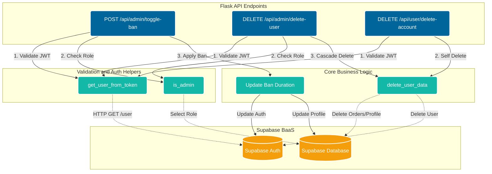

# Architecture 

## Flask API Diagram



## RPC Functions

### cancel_orders

```sql
DECLARE
  v_user_id UUID;
  v_status TEXT;
  v_menu_id INT;
  v_menu_date DATE;
  v_now_est TIMESTAMP;
  v_today_est DATE;
  v_item RECORD;
BEGIN
  SELECT user_id, status, menu_id 
  INTO v_user_id, v_status, v_menu_id
  FROM public."Orders"
  WHERE order_id = p_order_id;

  IF NOT FOUND THEN
    RAISE EXCEPTION 'Order not found.';
  END IF;

  IF v_user_id <> auth.uid() THEN
    RAISE EXCEPTION 'Unauthorized: You do not own this order.';
  END IF;

  IF v_status <> 'PENDING' THEN
    RAISE EXCEPTION 'Only pending orders can be cancelled.';
  END IF;

  SELECT "date"
  INTO v_menu_date
  FROM public."MenuDays"
  WHERE menu_day_id = v_menu_id;

  v_now_est := timezone('America/Toronto', CURRENT_TIMESTAMP);
  v_today_est := v_now_est::date;

  IF v_menu_date < v_today_est THEN
    RAISE EXCEPTION 'Order cancellation period has passed.';
  END IF;

  IF v_menu_date = v_today_est AND v_now_est::time >= TIME '12:00' THEN
    RAISE EXCEPTION 'Same-day orders cannot be cancelled after noon.';
  END IF;

  FOR v_item IN
    SELECT dish_id, quantity
    FROM public."OrderItems"
    WHERE order_id = p_order_id
  LOOP
    UPDATE public."MenuDayDishes"
    SET stock = stock + v_item.quantity
    WHERE menu_id = v_menu_id AND dish_id = v_item.dish_id;
  END LOOP;

  DELETE FROM public."OrderItems" WHERE order_id = p_order_id;
```

### cancel_pending_orders

```sql
DECLARE
  v_user_id UUID;
  v_status TEXT;
  v_menu_id INT;
  v_item RECORD;
BEGIN

  SELECT user_id, status, menu_id INTO v_user_id, v_status, v_menu_id
  FROM public."Orders"
  WHERE order_id = p_order_id;

  IF NOT FOUND THEN
    RAISE EXCEPTION 'Order not found.';
  END IF;

  IF v_user_id != auth.uid() THEN
    RAISE EXCEPTION 'Unauthorized: You do not own this order.';
  END IF;
  
  IF v_status != 'PENDING' THEN
    RAISE EXCEPTION 'Only pending orders can be cancelled.';
  END IF;
  FOR v_item IN 
    SELECT dish_id, quantity 
    FROM public."OrderItems" 
    WHERE order_id = p_order_id 
  LOOP
    UPDATE public."MenuDayDishes"
    SET stock = stock + v_item.quantity
    WHERE menu_id = v_menu_id AND dish_id = v_item.dish_id;
  END LOOP;
  DELETE FROM public."OrderItems" WHERE order_id = p_order_id;
```

### place_order

```sql
DECLARE
  v_order_id INT;
  v_total DECIMAL(10,2) := 0;
  v_item RECORD;
  v_dish_price DECIMAL(10,2);
  v_stock INT;
  v_order_number INT;

  v_menu_date DATE;
  v_now_est TIMESTAMPTZ;
  v_today_est DATE;
BEGIN
  SELECT "date"
  INTO v_menu_date
  FROM public."MenuDays"
  WHERE menu_day_id = p_menu_id;

  v_now_est := CURRENT_TIMESTAMP;
  v_today_est := (v_now_est AT TIME ZONE 'America/Toronto')::date;

  IF v_menu_date < v_today_est THEN
    RAISE EXCEPTION 'Ordering period has passed for this menu.';
  END IF;

  IF v_menu_date = v_today_est
     AND (v_now_est AT TIME ZONE 'America/Toronto')::time >= TIME '12:00' THEN
    RAISE EXCEPTION 'Same-day ordering closes at noon.';
  END IF;

  IF EXISTS (
    SELECT 1 FROM public."Orders"
    WHERE user_id = auth.uid() AND menu_id = p_menu_id
  ) THEN
    RAISE EXCEPTION 'You already have an active order for this menu.';
  END IF;

  IF EXISTS (
    SELECT 1 FROM public."Orders" 
    WHERE user_id = auth.uid() AND menu_id = p_menu_id 
  ) THEN
    RAISE EXCEPTION 'You already have an active order for this menu.';
  END IF;

  FOR v_item IN
    SELECT * FROM jsonb_to_recordset(p_items) AS x(dish_id INT, quantity INT)
  LOOP
    SELECT m.stock, d.price
    INTO v_stock, v_dish_price
    FROM public."MenuDayDishes" m
    JOIN public."Dishes" d ON m.dish_id = d.dish_id
    WHERE m.menu_id = p_menu_id AND m.dish_id = v_item.dish_id
    FOR UPDATE;

    IF v_stock < v_item.quantity THEN
      RAISE EXCEPTION 'Not enough stock for dish %', v_item.dish_id;
    END IF;

    v_total := v_total + (v_dish_price * v_item.quantity);
  END LOOP;

  v_order_number := floor(random() * 90000000 + 10000000)::int;

  INSERT INTO public."Orders"
    (user_id, menu_id, notes, total, order_number, status)
  VALUES
    (auth.uid(), p_menu_id, p_notes, v_total, v_order_number, 'PENDING')
  RETURNING order_id INTO v_order_id;

  FOR v_item IN
    SELECT * FROM jsonb_to_recordset(p_items) AS x(dish_id INT, quantity INT)
  LOOP
    SELECT price INTO v_dish_price
    FROM public."Dishes"
    WHERE dish_id = v_item.dish_id;

    UPDATE public."MenuDayDishes"
    SET stock = stock - v_item.quantity
    WHERE menu_id = p_menu_id AND dish_id = v_item.dish_id;

    INSERT INTO public."OrderItems"
      (order_id, dish_id, quantity, subtotal)
    VALUES
      (v_order_id, v_item.dish_id, v_item.quantity, v_dish_price * v_item.quantity);

  END LOOP;

  RETURN v_order_id;
END;
```

## Trigger Functions

### handle_new_user

```sql
declare
  v_role public.role;  
begin
  if new.email ilike '%@saultcollege.ca' then
    v_role := 'USER';
  else
    v_role := 'NO_ACCESS';
  end if;

  insert into public.profiles (
    id,
    first_name,
    last_name,
    email,
    role
  )
  values (
    new.id,
    new.raw_user_meta_data ->> 'first_name',
    new.raw_user_meta_data ->> 'last_name',
    new.email,
    v_role
  );

  return new;
end;
```

### protect_order_columns


```sql
BEGIN
  IF NOT public.is_admin() THEN
    NEW.status = OLD.status;
    NEW.total = OLD.total;
    NEW.user_id = OLD.user_id;
    NEW.menu_id = OLD.menu_id;
    NEW.timestampz = OLD.timestampz;
    NEW.order_number = OLD.order_number;
    NEW.notes = OLD.notes;
  END IF;
  
  RETURN NEW;
END;
```

This is triggered by `enforce_order_column_protection`

### protect_profile_columns

```sql
BEGIN
  IF current_setting('request.jwt.claims', true)::json->>'role' = 'service_role' OR auth.uid() IS NULL THEN
    RETURN NEW;
  END IF;

  IF NOT public.is_admin() THEN
    NEW.role = OLD.role;
    NEW.is_banned = OLD.is_banned;
  END IF;
  
  RETURN NEW;
END;
```

This is triggered by `enforce_profile_column_protection`

## Database Functions

### is_admin

```sql
  SELECT EXISTS (
    SELECT 1 FROM profiles
    WHERE id = auth.uid() AND role = 'ADMIN'
  );
```

### mark_expired_orders

```sql
BEGIN
  UPDATE public."Orders" o
  SET status = 'INACTIVE'
  FROM public."MenuDays" m
  WHERE o.menu_id = m.menu_day_id
    AND o.status = 'PENDING'
    AND m."date" < (CURRENT_DATE AT TIME ZONE 'America/Toronto');
END;
```

This is a function that is scheduled to run `pg_cron` 

```sql
SELECT cron.schedule(
  'mark_expired_orders',
  '0 4 * * *',  
  $$SELECT public.mark_expired_orders();$$
);
```

You can view this schedule with this query

```sql
SELECT jobid, schedule, command, nodename, active
FROM cron.job
ORDER BY jobid;
```