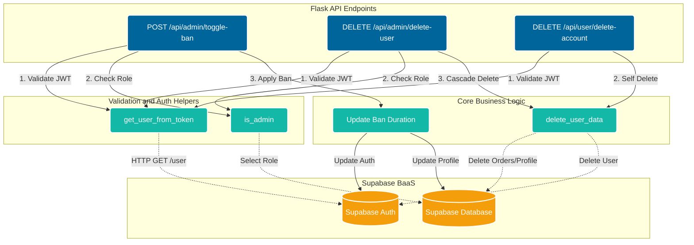

```mermaid
graph TD
classDef endpoint fill:#00659B,stroke:#fff,stroke-width:2px,color:#fff,rx:5px,ry:5px;
classDef helper fill:#14b8a6,stroke:#fff,stroke-width:2px,color:#fff,rx:5px,ry:5px;
classDef external fill:#f59e0b,stroke:#fff,stroke-width:2px,color:#fff,rx:5px,ry:5px;

    subgraph Flask API Endpoints
        ToggleBan[POST /api/admin/toggle-ban]:::endpoint
        AdminDel[DELETE /api/admin/delete-user]:::endpoint
        UserDel[DELETE /api/user/delete-account]:::endpoint
    end

    subgraph Validation and Auth Helpers
        GetToken[get_user_from_token]:::helper
        IsAdmin[is_admin]:::helper
    end

    subgraph Core Business Logic
        DeleteData[delete_user_data]:::helper
        BanLogic[Update Ban Duration]:::helper
    end

    subgraph Supabase BaaS
        SupabaseDB[(Supabase Database)]:::external
        SupabaseAuth[(Supabase Auth)]:::external
    end

    ToggleBan -->|1. Validate JWT| GetToken
    ToggleBan -->|2. Check Role| IsAdmin
    ToggleBan -->|3. Apply Ban| BanLogic
    BanLogic -->|Update Auth| SupabaseAuth
    BanLogic -->|Update Profile| SupabaseDB

    AdminDel -->|1. Validate JWT| GetToken
    AdminDel -->|2. Check Role| IsAdmin
    AdminDel -->|3. Cascade Delete| DeleteData

    UserDel -->|1. Validate JWT| GetToken
    UserDel -->|2. Self Delete| DeleteData

    GetToken -.->|HTTP GET /user| SupabaseAuth
    IsAdmin -.->|Select Role| SupabaseDB
    DeleteData -.->|Delete Orders/Profile| SupabaseDB
    DeleteData -.->|Delete User| SupabaseAuth

```