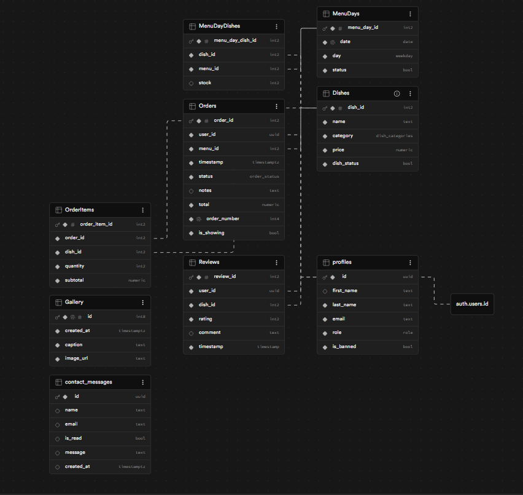

```sql 
-- WARNING: This schema is for context only and is not meant to be run.
-- Table order and constraints may not be valid for execution.
```

CREATE TABLE public.Dishes (
  dish_id smallint GENERATED ALWAYS AS IDENTITY NOT NULL,
  name text NOT NULL,
  category USER-DEFINED NOT NULL,
  price numeric NOT NULL,
  dish_status boolean NOT NULL DEFAULT true,
  CONSTRAINT Dishes_pkey PRIMARY KEY (dish_id)
);
CREATE TABLE public.Gallery (
  id bigint GENERATED ALWAYS AS IDENTITY NOT NULL UNIQUE,
  created_at timestamp with time zone NOT NULL DEFAULT now(),
  caption text NOT NULL,
  image_url text NOT NULL,
  CONSTRAINT Gallery_pkey PRIMARY KEY (id)
);
CREATE TABLE public.MenuDayDishes (
  menu_day_dish_id smallint GENERATED ALWAYS AS IDENTITY NOT NULL,
  dish_id smallint NOT NULL,
  menu_id smallint NOT NULL,
  stock smallint,
  CONSTRAINT MenuDayDishes_pkey PRIMARY KEY (menu_day_dish_id),
  CONSTRAINT MenuDayDishes_dish_id_fkey FOREIGN KEY (dish_id) REFERENCES public.Dishes(dish_id),
  CONSTRAINT MenuDayDishes_menu_id_fkey FOREIGN KEY (menu_id) REFERENCES public.MenuDays(menu_day_id)
);
CREATE TABLE public.MenuDays (
  menu_day_id smallint GENERATED ALWAYS AS IDENTITY NOT NULL,
  date date NOT NULL DEFAULT now() UNIQUE,
  day USER-DEFINED NOT NULL,
  status boolean NOT NULL DEFAULT true,
  CONSTRAINT MenuDays_pkey PRIMARY KEY (menu_day_id)
);
CREATE TABLE public.OrderItems (
  order_item_id smallint GENERATED ALWAYS AS IDENTITY NOT NULL,
  order_id smallint NOT NULL,
  dish_id smallint NOT NULL,
  quantity smallint NOT NULL,
  subtotal numeric NOT NULL,
  CONSTRAINT OrderItems_pkey PRIMARY KEY (order_item_id),
  CONSTRAINT OrderItems_order_id_fkey FOREIGN KEY (order_id) REFERENCES public.Orders(order_id),
  CONSTRAINT OrderItems_dish_id_fkey FOREIGN KEY (dish_id) REFERENCES public.Dishes(dish_id)
);
CREATE TABLE public.Orders (
  order_id smallint GENERATED ALWAYS AS IDENTITY NOT NULL,
  user_id uuid NOT NULL DEFAULT gen_random_uuid(),
  menu_id smallint NOT NULL,
  timestamp timestamp with time zone NOT NULL DEFAULT now(),
  status USER-DEFINED NOT NULL DEFAULT 'PENDING'::order_status,
  notes text,
  total numeric NOT NULL,
  order_number integer NOT NULL UNIQUE,
  is_showing boolean NOT NULL DEFAULT true,
  CONSTRAINT Orders_pkey PRIMARY KEY (order_id),
  CONSTRAINT Orders_menu_id_fkey FOREIGN KEY (menu_id) REFERENCES public.MenuDays(menu_day_id),
  CONSTRAINT Orders_user_id_fkey1 FOREIGN KEY (user_id) REFERENCES public.profiles(id)
);
CREATE TABLE public.Reviews (
  review_id smallint GENERATED ALWAYS AS IDENTITY NOT NULL,
  user_id uuid NOT NULL DEFAULT gen_random_uuid(),
  dish_id smallint NOT NULL,
  rating smallint NOT NULL,
  comment text,
  timestamp timestamp without time zone NOT NULL,
  CONSTRAINT Reviews_pkey PRIMARY KEY (review_id),
  CONSTRAINT Reviews_dish_id_fkey FOREIGN KEY (dish_id) REFERENCES public.Dishes(dish_id),
  CONSTRAINT Reviews_user_id_fkey FOREIGN KEY (user_id) REFERENCES public.profiles(id)
);
CREATE TABLE public.contact_messages (
  id uuid NOT NULL DEFAULT gen_random_uuid(),
  name text DEFAULT ''::text,
  email text DEFAULT ''::text,
  is_read boolean DEFAULT false,
  message text DEFAULT ''::text,
  created_at timestamp with time zone DEFAULT now(),
  CONSTRAINT contact_messages_pkey PRIMARY KEY (id)
);
CREATE TABLE public.profiles (
  id uuid NOT NULL,
  first_name text,
  last_name text NOT NULL,
  email text NOT NULL,
  role USER-DEFINED NOT NULL,
  is_banned boolean NOT NULL DEFAULT false,
  CONSTRAINT profiles_pkey PRIMARY KEY (id),
  CONSTRAINT profiles_id_fkey FOREIGN KEY (id) REFERENCES auth.users(id)
);


## Table Descriptions

### Dishes:

Purpose: Stores information on dishes as well as their current active status.

### Gallery:

Purpose: Stores image information for the gallery.

### MenuDayDishes:

Purpose: Join table for dishes and 

### MenuDays:

### OrderItems:

### Orders:

### profiles:

### Reviews:

### contact_messages:
