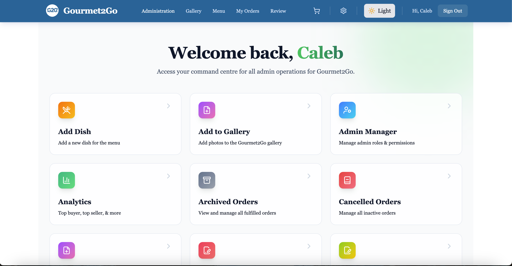
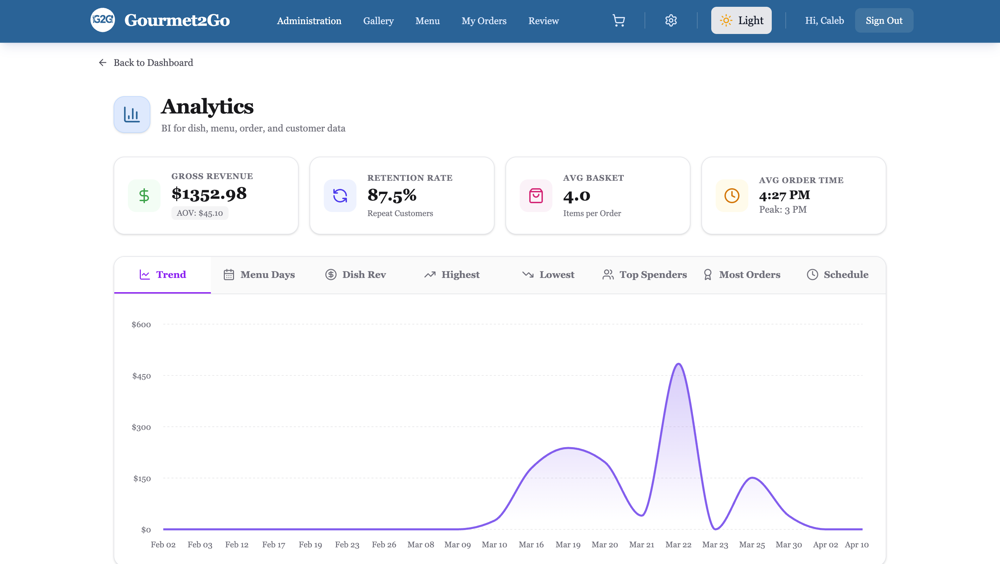
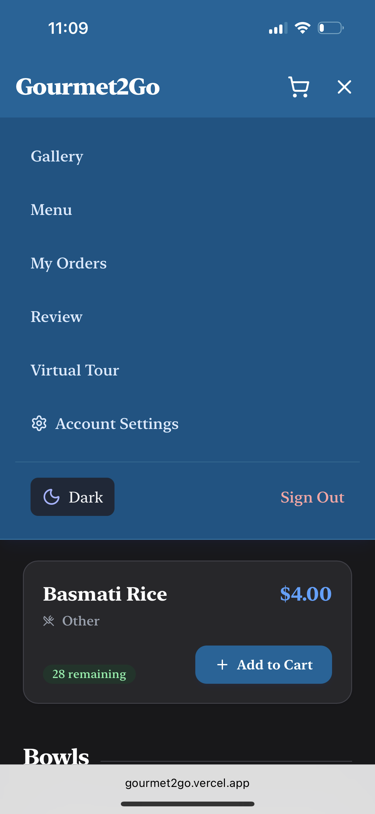
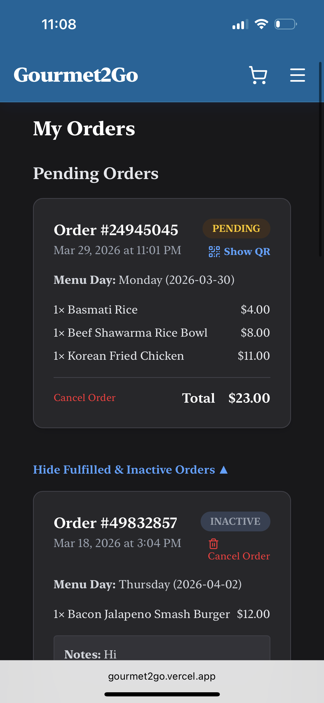

# Design System 

This document details the visual architecture and styling methodology used in the Gourmet2Go project. Our design goal was to combine the elegance of a high-end restaurant with the efficiency of a modern web application.

---

## Why Tailwind CSS?

We selected **Tailwind CSS** as our primary styling engine. In a collaborative environment with four developers, Tailwind provided a "single source of truth" for our UI.

### Key Benefits
| Benefit | Description |
| :--- | :--- |
| **Consistency** | Standardized spacing and color scales prevented "CSS drift" between different team members. |
| **Performance** | Tailwind's compiler ensures the final PWA only loads the styles actually used, keeping the app fast. |
| **Responsive** | Built-in mobile-first modifiers (e.g., `md:`, `lg:`) allowed us to optimize the ordering experience for phones. |
| **Maintenance** | By keeping styles in the `.tsx` files, we eliminated the risk of "Dead CSS" and simplified debugging. |

---

## Colour Palette

Our palette is inspired by the **Sault College** identity, refined with a professional "Zinc" grayscale to provide depth in both themes.

### Primary Branding
| Colour | Hex Code | Purpose |
| :--- | :--- | :--- |
| **Gourmet Blue** | `#00659B` | Used for the Navbar, primary buttons, and overall branding. |
| **Sault Green** | `#3ECF8E` | Used for success states, "Complete" buttons, and positive growth in analytics. |
| **Midnight** | `#09090b` | The base background color for the Dark Mode experience. |

### Semantic UI Colors
| Category | Variable | Purpose |
| :--- | :--- | :--- |
| **Warning** | `Amber-500` | Indicates "Pending" orders or "Low Stock" items. |
| **Danger** | `Red-600` | Used for destructive actions (Delete/Ban) and error messages. |
| **Surfaces** | `Zinc-50` | Background for light-mode cards to create a layered effect. |

---

## Adaptive Theming

Gourmet2Go features a fully integrated **Light and Dark Mode** system that respects user preferences and persists across sessions.

### Implementation Logic
*   **State Management:** We use a `DarkModeToggle` component that interacts with the `document.documentElement` class list.
*   **Persistence:** The user's selection is stored in `localStorage` so the theme does not "flicker" on page reloads.
*   **Light Mode:** Focuses on high-contrast black text on white surfaces for maximum readability in campus light.
*   **Dark Mode:** Designed for kitchen environments; uses a "Layered Obsidian" depth where cards are slightly lighter than the background.

---

## Typography

We utilized a **Dual-Font Strategy** to balance professional branding with technical legibility.

### 1. The Heading Font (Serif)
*   **Usage:** Used for main page titles and the "Gourmet2Go" brand text.
*   **Impact:** Serif fonts evoke the feeling of a classic, printed restaurant menu, reinforcing our "Gourmet" brand.

### 2. The Interface Font (Montserrat)
*   **Usage:** Used for all buttons, stock counts, labels, and the Admin Dashboard.
*   **Impact:** A clean, geometric sans-serif that remains highly readable at small sizes on mobile devices.

---

## Component Showcase

### Admin Dashboard (Tile System)
The "Command Centre" utilizes a modular tile system. Each tile features a distinct linear gradient and a Lucide icon for intuitive navigation.

### Business Intelligence (Analytics)
Our data visualization uses `Recharts` and `Luxon`. The charts dynamically adjust their stroke and fill colors based on the current theme (Light/Dark).

### The Navigation & Cart
The mobile experience focuses on accessibility, using an `AnimatePresence` drawer for the cart and a full-screen overlay for mobile navigation.

### Order Tracking & QR Codes
The "My Orders" interface provides high-contrast badges for status tracking and a dynamically generated QR code for contactless kitchen pickup.

