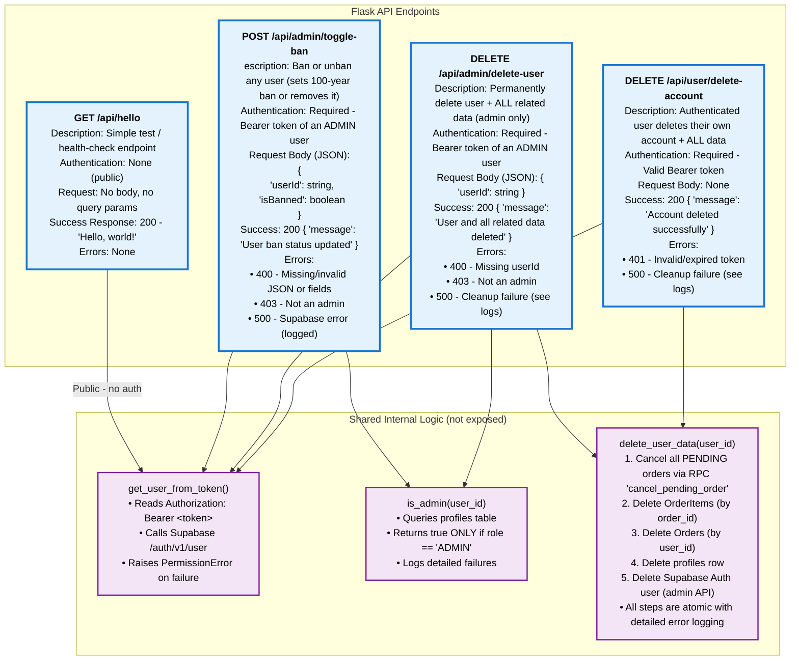

# Flask API Endpoints

## Diagram

## Table

| Method | Path                     | Auth Required          | Request Body                        | Common Errors | Notes |
| :---   | :---                     | :---                   | :---                                | :---          | :---     |
| GET    | /api/hello               | None                   | -                                   | -             | Test endpoint    |
| POST   | /api/admin/toggle-ban    | Admin Bearer token     | {"userId": "...", "isBanned": true} | 400, 403, 500 | Updates both Supabase Auth ban + profiles.is_banned     |
| DELETE | /api/admin/delete-user   | Admin Bearer token     | {"userId": "..."}                   | 400, 403, 500 | Full cascade delete (orders, items, profile, auth)    |
| DELETE | /api/user/delete-account | Any valid Bearer token | -                                   | 401, 500      | Same cleanup as admin delete (self-service)     |