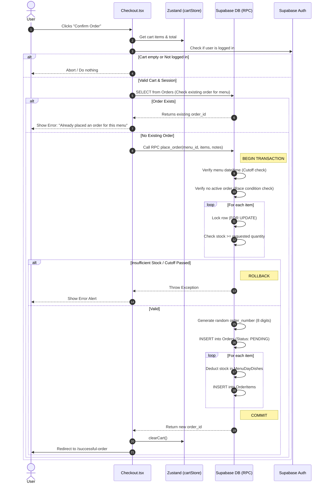
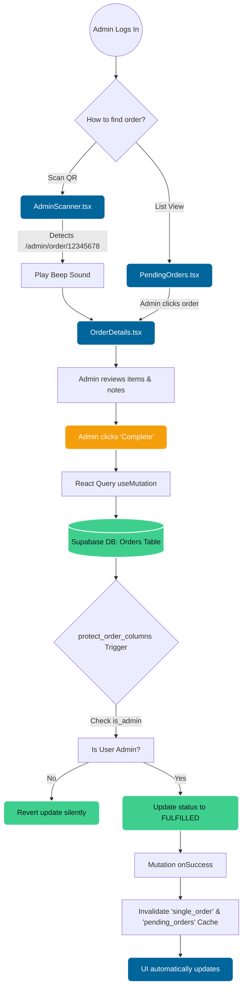
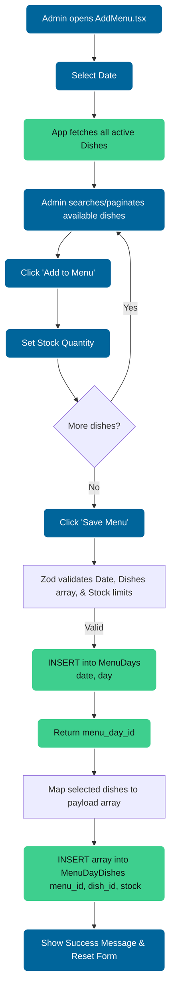
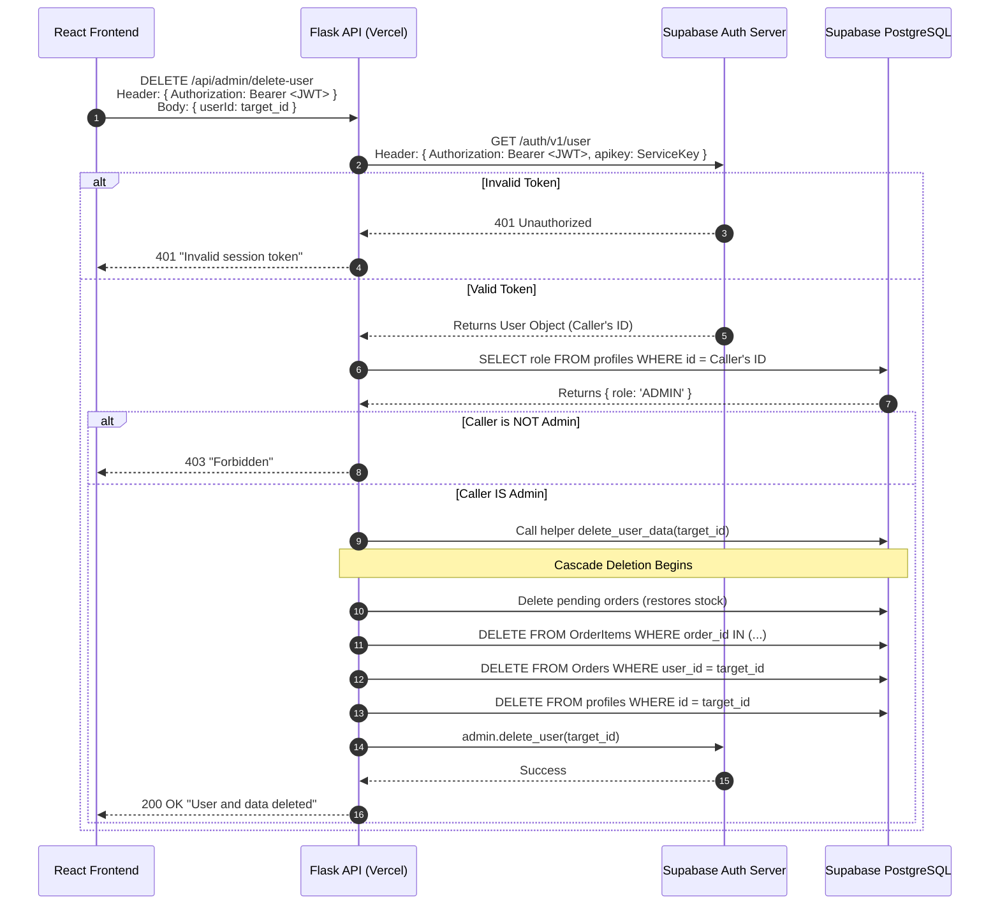
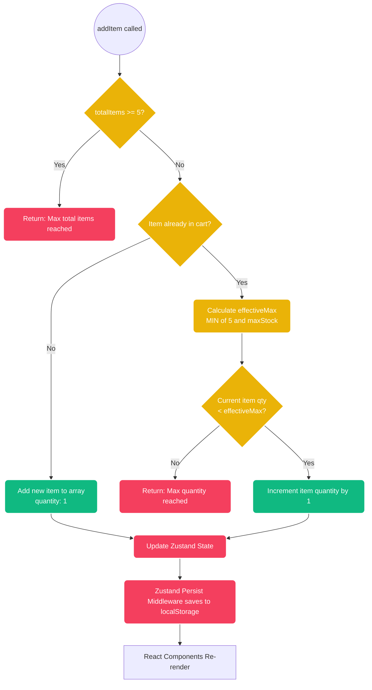
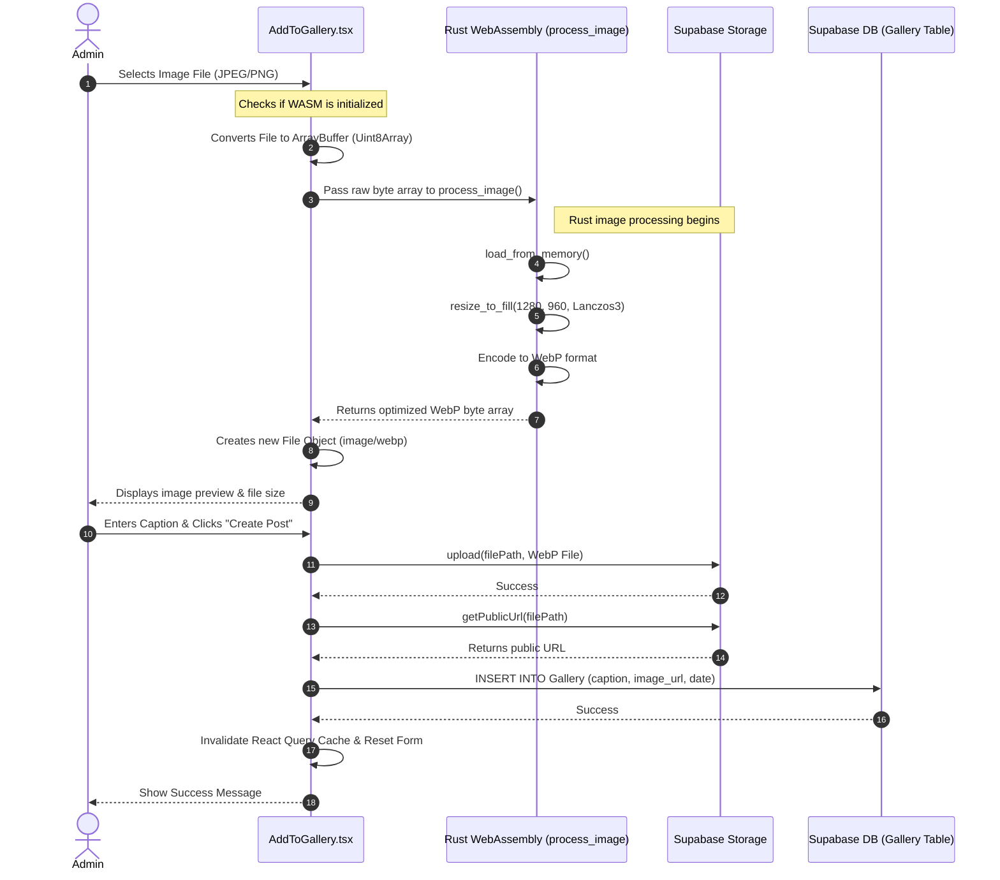

# System Flows

## Checkout Process Flow

## Admin Fulfill Order Process Flow

## Menu Creation Process Flow

## Flask JWT Token Data Flow

## Cart State Manager Data Flow

## Add to Gallery Data Flow

