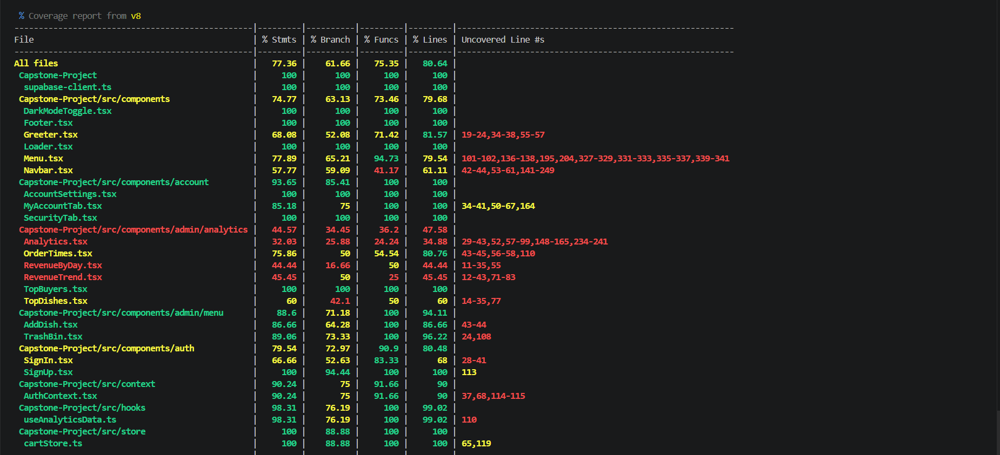

# Testing Documentation

## Overview

The Gourmet2Go project uses a comprehensive testing strategy to ensure code quality, reliability, and maintainability. Our test suite covers frontend components, backend logic, database operations, and user interactions.

**Total Tests:** 340+ passing tests  
**Coverage:** ~81% overall coverage  
**Framework:** Vitest + React Testing Library  
**CI/CD:** Automated testing via GitHub Actions

---

## Quick Start

### Running Tests

```bash
# Run all tests
npm test

# Run tests in watch mode
npm run test:watch

# Run tests with coverage report
npm run -- --coverage

# Run specific test file
npm test Analytics

# Run tests matching a pattern
npm test -- --grep "authentication"
```

### Test Results

All tests run automatically on every push via GitHub Actions. Check the "Actions" tab on GitHub to see test results.

---

## Test Coverage

### Current Coverage Statistics

- **Statements:** ~81%
- **Branches:** ~61%
- **Functions:** ~82%
- **Lines:** ~81%

### Coverage Report Screenshot
- 

### High-Coverage Areas

- **Analytics Logic:** 98% (useAnalyticsData hook)
- **Cart Store:** 100% (Zustand state management)
- **Authentication:** 90%+ (Sign in/up flows)
- **Components:** 80%+ (UI components)

---

## Test Structure

### Directory Organization

```
src/
├── tests/
│   ├── Analytics.test.tsx          # Main analytics dashboard (15 tests)
│   ├── useAnalyticsData.test.ts    # Analytics hook logic (21 tests)
│   ├── TopDishes.test.tsx          # Top dishes chart (13 tests)
│   ├── TopBuyers.test.tsx          # Top buyers chart (14 tests)
│   ├── OrderTimes.test.tsx         # Order times heatmap (17 tests)
│   ├── RevenueTrend.test.tsx       # Revenue trend chart (17 tests)
│   ├── RevenueByDay.test.tsx       # Revenue by day chart (14 tests)
│   ├── TrashBin.test.tsx           # Trash bin functionality (16 tests)
│   ├── SignIn.test.tsx             # Sign in authentication (13 tests)
│   ├── SignUp.test.tsx             # Sign up registration (17 tests)
│   ├── cartStore.test.ts           # Shopping cart logic (30 tests)
│   ├── AuthContext.test.tsx        # Auth context provider (9 tests)
│   ├── Navbar.test.tsx             # Navigation component (10 tests)
│   ├── Footer.test.tsx             # Footer component (11 tests)
│   ├── Menu.test.tsx               # Menu display (6 tests)
│   ├── MyAccountTab.test.tsx       # Account settings (16 tests)
│   ├── AccountSettings.test.tsx    # Account info (12 tests)
│   ├── SecurityTab.test.tsx        # Security settings (11 tests)
│   ├── DarkModeToggle.test.tsx     # Dark mode (10 tests)
│   ├── Loader.test.tsx             # Loading spinner (7 tests)
│   ├── AddDish.test.tsx            # Add dish form (1 test)
│   ├── MenuInteractions.test.tsx   # Menu interactions (4 tests)
│   ├── MenuCutoff.test.tsx         # Menu cutoff logic (1 test)
│   ├── signInSchema.test.ts        # Sign in validation (8 tests)
│   ├── signUpSchema.test.ts        # Sign up validation (11 tests)
│   ├── AddDishSchema.test.ts       # Dish validation (8 tests)
│   ├── MenuDatabase.test.ts        # Menu DB operations (7 tests)
│   ├── AddMenuDatabase.test.ts     # Add menu DB ops (7 tests)
│   ├── AddDishDatabase.test.ts     # Add dish DB ops (6 tests)
│   └── CheckoutDatabase.test.ts    # Checkout DB ops (8 tests)
```

---

## Test Categories

### 1. Analytics Tests (111 tests)

**Purpose:** Validate analytics dashboard calculations and visualizations

**Files:**
- `useAnalyticsData.test.ts` - Core calculation logic (21 tests)
- `TopDishes.test.tsx` - Bar chart component (13 tests)
- `TopBuyers.test.tsx` - Buyer chart component (14 tests)
- `OrderTimes.test.tsx` - Heatmap component (17 tests)
- `RevenueTrend.test.tsx` - Trend chart component (17 tests)
- `RevenueByDay.test.tsx` - Day chart component (14 tests)
- `Analytics.test.tsx` - Main dashboard page (15 tests)

**Coverage:**
- Business logic calculations: 98%
- Component rendering: 80%+
- Edge cases: Comprehensive (zero values, high values, empty data)

**Key Features Tested:**
- Revenue calculations and aggregations
- Top-selling dishes and categories
- Customer spending patterns
- Order time heatmaps
- Revenue trends over time
- KPI calculations (AOV, retention rate, basket size)

### 2. Authentication Tests (48 tests)

**Purpose:** Ensure secure user authentication and authorization

**Files:**
- `SignIn.test.tsx` - Sign in flow (13 tests)
- `SignUp.test.tsx` - Registration flow (17 tests)
- `signInSchema.test.ts` - Sign in validation (8 tests)
- `signUpSchema.test.ts` - Sign up validation (11 tests)
- `AuthContext.test.tsx` - Auth context (9 tests)

**Coverage:**
- Form validation: 90%+
- Authentication flow: 85%+
- Error handling: Comprehensive

**Key Features Tested:**
- Email/password validation
- Supabase authentication integration
- Role-based access control (RBAC)
- Session management
- Error handling and user feedback

### 3. Cart & Checkout Tests (38 tests)

**Purpose:** Validate shopping cart and checkout functionality

**Files:**
- `cartStore.test.ts` - Cart state management (30 tests)
- `CheckoutDatabase.test.ts` - Checkout operations (8 tests)

**Coverage:** 100% (cart store)

**Key Features Tested:**
- Add/remove items from cart
- Quantity updates
- Price calculations
- Cart persistence (localStorage)
- Checkout validation
- Order creation

### 4. Component Tests (90+ tests)

**Purpose:** Ensure UI components render and behave correctly

**Files:**
- Navigation: `Navbar.test.tsx` (10 tests), `Footer.test.tsx` (11 tests)
- Account: `MyAccountTab.test.tsx` (16 tests), `AccountSettings.test.tsx` (12 tests)
- Security: `SecurityTab.test.tsx` (11 tests)
- UI Elements: `DarkModeToggle.test.tsx` (10 tests), `Loader.test.tsx` (7 tests)
- Menu: `Menu.test.tsx` (6 tests), `MenuInteractions.test.tsx` (4 tests), `MenuCutoff.test.tsx` (1 test)
- Admin: `AddDish.test.tsx` (1 test), `TrashBin.test.tsx` (16 tests)

**Coverage:** 75-90%

**Key Features Tested:**
- Component rendering with various props
- User interactions (clicks, form submissions)
- Conditional rendering
- Dark mode support
- Responsive behavior
- Loading and error states

### 5. Database Tests (28 tests)

**Purpose:** Validate database operations and data integrity

**Files:**
- `MenuDatabase.test.ts` - Menu CRUD operations (7 tests)
- `AddMenuDatabase.test.ts` - Menu creation (7 tests)
- `AddDishDatabase.test.ts` - Dish creation (6 tests)
- `CheckoutDatabase.test.ts` - Order processing (8 tests)

**Coverage:** Database functions and edge cases

**Key Features Tested:**
- CRUD operations
- Data validation
- Constraint enforcement
- Error handling
- Transaction integrity

### 6. Trash Management Tests (16 tests)

**Purpose:** Validate soft delete and restore functionality

**File:** `TrashBin.test.tsx`

**Coverage:** All trash bin operations

**Key Features Tested:**
- Display deleted dishes and menus
- Search functionality (by name, category, date)
- Restore deleted items
- Permanent deletion with confirmation
- Foreign key constraint handling
- Empty states and error handling

---

## Testing Approach

### 1. Unit Testing

**Focus:** Individual functions and components in isolation

**Tools:** Vitest, React Testing Library

**Examples:**
- Calculation functions (analytics aggregations)
- Validation schemas (Zod validators)
- State management (Zustand stores)

### 2. Component Testing

**Focus:** React component behavior and rendering

**Tools:** React Testing Library, @testing-library/user-event

**Examples:**
- Form submissions and validation
- User interactions (clicks, typing)
- Conditional rendering
- Props handling

### 3. Integration Testing

**Focus:** Multiple components working together

**Examples:**
- Authentication flow (form → API → redirect)
- Cart operations (add → update → checkout)
- Menu interactions (browse → select → order)

### 4. Mocking Strategy

**Supabase Client:** Mocked for all database operations
```typescript
vi.mock('../supabase-client', () => ({
  supabase: {
    from: vi.fn(),
    auth: vi.fn(),
  },
}));
```

**React Query:** Wrapped components in QueryClientProvider
```typescript
const queryClient = new QueryClient({
  defaultOptions: { queries: { retry: false } },
});
```

**Browser APIs:** Mocked window.confirm, window.alert, localStorage

---

## Writing New Tests

### Test File Naming Convention

- **Components:** `ComponentName.test.tsx`
- **Hooks:** `useHookName.test.ts`
- **Utilities:** `utilityName.test.ts`
- **Schemas:** `schemaName.test.ts`

### Test Structure Template

```typescript
import { describe, it, expect, vi, beforeEach } from 'vitest';
import { render, screen } from '@testing-library/react';
import userEvent from '@testing-library/user-event';
import { ComponentName } from '../path/to/component';

describe('ComponentName', () => {
  beforeEach(() => {
    vi.clearAllMocks();
  });

  describe('Feature Group', () => {
    it('should do something specific', () => {
      
      const props = { /* ... */ };
      
      render(<ComponentName {...props} />);
      
      expect(screen.getByText('Expected Text')).toBeInTheDocument();
    });
  });
});
```

### Best Practices

1. **Organize tests by feature:** Group related tests in `describe` blocks
2. **Use clear test descriptions:** Write "should..." or action-based descriptions
3. **Follow AAA pattern:** Arrange, Act, Assert
4. **Test user behavior:** Focus on what users see and do, not implementation details
5. **Mock external dependencies:** Database calls, API requests, browser APIs
6. **Clean up after tests:** Use `beforeEach` and `afterEach` hooks
7. **Test edge cases:** Empty states, null values, error conditions
8. **Avoid testing third-party libraries:** Trust that React, Recharts, etc. work

### What to Test

**DO Test:**
- Component rendering with various props
- User interactions and event handlers
- Form validation and submission
- Conditional rendering logic
- Error states and edge cases
- Business logic and calculations
- Database operations (mocked)

**DON'T Test:**
- Third-party library internals
- Exact CSS styling
- Implementation details (state variable names, etc.)
- Browser API behavior (assume they work)

---

## Continuous Integration

### GitHub Actions Workflow

Tests run automatically on:
- **Every push** to any branch
- **Every pull request** creation/update
- **Scheduled runs** (optional)

### Workflow Configuration

Located in `.github/workflows/frontend-tests.yml`

**Key steps:**
1. Checkout code
2. Setup Node.js
3. Install dependencies
4. Run test suite
5. Report results

### Required Checks

All PRs must pass:
- Frontend Tests (340+ tests)
- Backend Tests (Python)
- CodeQL Security Scans
- Code Quality Checks

---

## Troubleshooting

### Common Issues

**Issue:** Tests pass locally but fail in CI
- **Solution:** Check Node.js version, ensure dependencies are locked in package-lock.json

**Issue:** "Cannot find module" errors
- **Solution:** Verify import paths are correct relative to test file location

**Issue:** Tests timeout
- **Solution:** Increase timeout in test file or check for unresolved promises

**Issue:** Recharts dimension warnings
- **Solution:** These are cosmetic warnings in test environment, safe to ignore if tests pass

**Issue:** React Testing Library "not wrapped in act(...)" warnings
- **Solution:** Use `waitFor()` for async operations, ensure state updates complete

### Debugging Tests

```bash
# Run single test file with verbose output
npm test -- Analytics --reporter=verbose

# Run tests in UI mode (interactive)
npm run test -- --ui

# Debug specific test
npm test -- --grep "specific test name"
```

---

## Coverage Reports

### Generating Coverage

```bash
npm run -- --coverage
```

This creates:
- Terminal summary
- HTML report in `coverage/` directory

### Viewing HTML Report

Open `coverage/index.html` in a browser for detailed coverage visualization.

### Coverage Goals

- **Critical paths:** 90%+ (authentication, checkout, payments)
- **Business logic:** 85%+ (analytics calculations, cart operations)
- **UI components:** 75%+ (rendering, interactions)
- **Overall:** 80%+ (current: ~81%)

---

## Testing Philosophy

### Our Approach

1. **Test behavior, not implementation:** Focus on what users see and do
2. **Test the happy path first:** Ensure core functionality works
3. **Then test edge cases:** Empty states, errors, boundary conditions
4. **Mock external dependencies:** Database, API calls, browser APIs
5. **Keep tests simple and readable:** Tests are documentation
6. **Maintain tests like production code:** Refactor, update, improve

### What Makes a Good Test

**Reliable:** Passes consistently, no flaky failures  
**Fast:** Runs quickly, uses mocks for slow operations  
**Isolated:** Doesn't depend on other tests  
**Clear:** Easy to understand what's being tested  
**Maintainable:** Easy to update when code changes

---

## Resources

### Documentation

- [Vitest Documentation](https://vitest.dev/)
- [React Testing Library](https://testing-library.com/react)
- [Testing Library Best Practices](https://kentcdodds.com/blog/common-mistakes-with-react-testing-library)

### Internal Resources

- `CONTRIBUTING.md` - Guidelines for contributing code and tests
- `DATABASE_SCHEMA.md` - Database structure for writing DB tests
- `SETUP.md` - Project setup instructions

---

## Maintenance

### Updating Tests

When modifying features:
1. Update existing tests to match new behavior
2. Add new tests for new functionality
3. Remove tests for removed features
4. Ensure all tests pass before merging

### Test Review Checklist

Before merging test changes:
- [ ] All tests pass locally
- [ ] All tests pass in CI
- [ ] Coverage hasn't decreased
- [ ] Test descriptions are clear
- [ ] Edge cases are covered
- [ ] No commented-out tests
- [ ] No `.only` or `.skip` in committed code

---

**Last Updated:** April 2026  
**Test Count:** 340+ tests  
**Overall Coverage:** ~81%